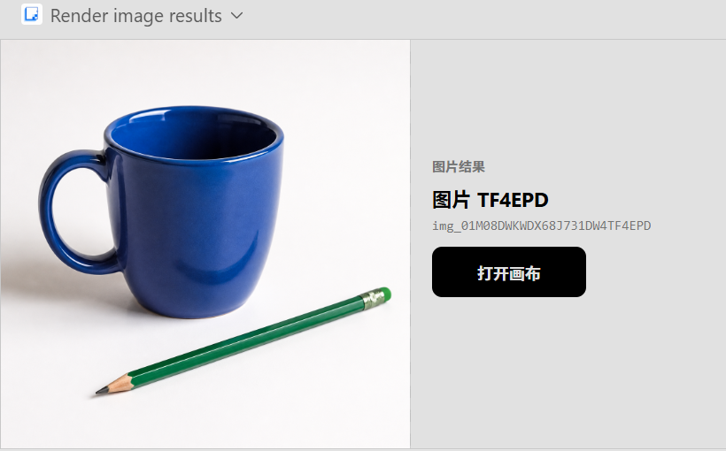
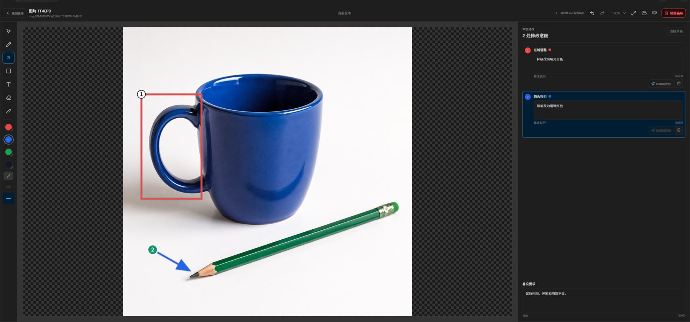

<div align="center">

# OpenAI 兼容图片

**通过你自己的 OpenAI 兼容图片 API 生成、编辑、批处理、检查并交付图片。**

[](https://github.com/Syh1906/openai-compatible-imagegen/releases)
[](LICENSE)
[](https://github.com/Syh1906/openai-compatible-imagegen/actions)

[English](README.md) | 简体中文

</div>

OpenAI 兼容图片把同一套图片核心发布为两种安装形态。Standalone Skill 适合 Agent 客户端和命令行工作流；Codex Plugin 在此基础上增加结果卡、聚焦画布、标注、不可变产物和版本历史。

## 选择安装形态

| 安装形态 | 适合场景 | 包含内容 |
| --- | --- | --- |
| **Standalone Skill** | Codex CLI、Claude Code、OpenCode 和其他 Agent Skills 客户端 | 生成、编辑、JSONL 批处理、透明处理、交付和 QA |
| **Codex Plugin** | 需要完整图片工作流的 Codex App 用户 | 共享能力，以及 MCP 工具、结果卡、画布编辑、产物和版本 |

每个使用环境选择一种安装形态。两者共享代码和版本，但使用各自的本地配置与产物目录。将已有配置迁移到 Codex Plugin 时，请按[迁移指南](docs/guides/migration.zh-CN.md)操作。

## Codex App 工作流

在会话中生成图片，再打开聚焦画布标记区域，并为每处修改添加说明。

**会话图片结果**



**聚焦编辑画布**



## 安装 Codex Plugin

需要：支持 Plugin 的 Codex、Git、Node.js 20+、Python 3.12 或更高版本，以及你自己的 OpenAI 兼容图片服务。Plugin ZIP 与平台无关，支持 Windows、macOS 和 Linux。

```text
codex plugin marketplace add Syh1906/openai-compatible-imagegen
codex plugin add openai-compatible-imagegen@openai-compatible-imagegen
```

如果 `openai-compatible-imagegen` marketplace 已注册，跳过第一条命令。安装后完全退出并重新启动 Codex 一次，让 Plugin 的 Skill、MCP 工具和包内依赖完整加载。

你也可以在 Codex App 打开 **Plugins**，选择 `openai-compatible-imagegen` marketplace，安装 **OpenAI-Compatible Images**。交互式 Codex CLI 会话可输入 `/plugins` 打开同一浏览器。

Git-backed 安装已经包含 MCP server 和 widget，不需要构建仓库或启动本地 Web 服务。

Plugin 在 Windows 默认调用 `python`，在 macOS/Linux 默认调用 `python3`，并要求 Python 3.12 或更高版本。默认命令不可用时，可通过 `OPENAI_COMPATIBLE_IMAGEGEN_PYTHON` 指定一个明确的 Python 可执行文件；覆盖值无效或预检失败时会停止，不会静默尝试其他命令。macOS/Linux 不提供 Windows 的“在文件夹中显示”，但不影响生成、编辑、产物、标注和画布流程。

需要从 GitHub Releases 安装指定版本的 Plugin ZIP 时，请按[本地 Plugin ZIP 安装流程](docs/guides/installation.zh-CN.md#从-plugin-zip-安装)操作。

[Plugin 安装与配置](docs/guides/installation.zh-CN.md#安装-codex-plugin)

## 安装 Standalone Skill

从 [GitHub Releases](https://github.com/Syh1906/openai-compatible-imagegen/releases) 下载 `openai-compatible-imagegen-skill-<version>.zip`。解压到客户端的 skills 目录，确保包根存在 `SKILL.md`，再启动新会话。

如果使用第三方 [`skills`](https://www.npmjs.com/package/skills) CLI，请先解压 Standalone ZIP，再把解压后的 `openai-compatible-imagegen` 目录作为包源。默认安装到当前项目。

Windows PowerShell：

```powershell
npx --yes skills@latest add "C:/path/to/openai-compatible-imagegen" --agent codex --skill openai-compatible-imagegen --copy --yes
```

macOS 或 Linux shell：

```text
npx --yes skills@latest add /path/to/openai-compatible-imagegen --agent codex --skill openai-compatible-imagegen --copy --yes
```

增加 `--global` 可安装到当前用户，在多个项目中使用。

Windows PowerShell：

```powershell
npx --yes skills@latest add "C:/path/to/openai-compatible-imagegen" --global --agent codex --skill openai-compatible-imagegen --copy --yes
```

macOS 或 Linux shell：

```text
npx --yes skills@latest add /path/to/openai-compatible-imagegen --global --agent codex --skill openai-compatible-imagegen --copy --yes
```

不要把本仓库根目录直接交给 CLI。Skills CLI 只用于首次安装已解压的 Standalone 压缩包。作用域、更新、回滚和卸载行为见 [Standalone 安装指南](docs/guides/installation.zh-CN.md#使用第三方-skills-cli-安装)。

[Standalone 安装路径与设置](docs/guides/installation.zh-CN.md#安装-standalone-skill)

更新命令、发行包替换和保留 Skill 凭据的切换方式见[更新 Plugin 或 Skill](docs/guides/updating.zh-CN.md)。

## 能做什么

- 生成图片，并使用一张或多张参考图编辑。
- 执行有边界的多图任务和异构批处理。
- 在交付变换前保留每张完整 API 原图。
- 缩放、适配、安全边距、网格拆分和预览板。
- 使用明确的色键、发光、mask 或已验证 prompt-alpha 路线准备透明结果。
- 对尺寸、alpha、边缘接触、边距和组件执行确定性检查。
- 凭据留在本地，只返回安全错误摘要。
- 在 Codex App 会话中查看结果，并进入聚焦标注画布继续编辑。

后端必须提供 `POST /v1/images/generations` 和 `POST /v1/images/edits`，响应包含 `data[].b64_json` 或 `data[].url`。

## 怎么使用

用自然语言说明主体、构图、尺寸、数量、透明要求、检查项和输出：

> 生成一张 16:9、2K 的新品发布横幅，再交付 1200x675 PNG。

> 保护笔记本，把马克杯改色，然后在聚焦画布中检查结果。

> 生成四张编辑插图，并保留可审计的 batch manifest。

Codex Plugin 在 App 中显示结果与画布操作。Standalone Skill 调用包内 CLI，并报告输出文件和 manifest 路径。Standalone 包保持独立，不包含 Plugin 的 MCP 或平台文件系统适配器。

## 文档

通过[文档导航](docs/README.zh-CN.md)查找安装、配置、迁移、更新、回滚、故障排查和架构说明。

## 安全

凭据保存在用户控制的文件或环境变量中。项目不运营托管图片服务，也不收集提示词和输出。安全报告方式与信任边界见 [SECURITY.md](SECURITY.md)。

## 许可证

[MIT](LICENSE)
