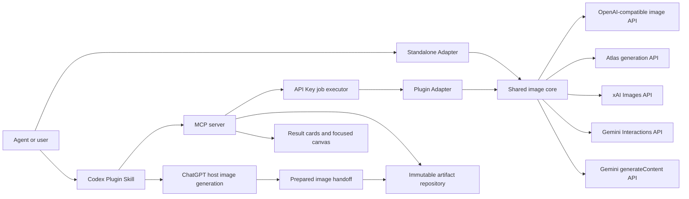

# Architecture
> Parent: [Documentation](./README.md)

Language: [简体中文](./arch.zh-CN.md)

This document describes module, dependency, configuration, state, and release boundaries for contributors and maintainers. For installation and configuration steps, use the [user guides](./guides/README.md).

## Implementation map

| Source | Responsibility |
| --- | --- |
| `scripts/` | Shared image protocol, validation, transforms, delivery, and QA |
| `mcp/` | Plugin tools, project binding, asynchronous jobs, artifacts, editor state, and runtime calls |
| `web/` | Codex result cards and focused image canvas |
| `web/widget-i18n.mjs` | English and Chinese Widget message catalog and locale resolution |
| `scripts/plugin-file-set.mjs` | Distribution file ownership and shared-core evidence |
| `.codex-plugin/plugin.json`, `.mcp.json` | Plugin identity and launch contract |
| `tests/` | Executable public behavior and release boundaries |

The Plugin runtime is platform-neutral at the package level. `scripts/repository_fs.py` is the Python artifact repository's filesystem entry point: it selects `windows_repository_fs.py` on Windows and `posix_repository_fs.py` on macOS/Linux. Both adapters expose the same repository, submission-lock, atomic-publication, and safe-path contract; the adapters are Plugin-only and are excluded from the Standalone archive.

## Core flow



## Distribution ownership

| Area | Shared | Standalone only | Plugin only |
| --- | --- | --- | --- |
| Image transport and response validation | Yes |  |  |
| PNG transforms, transparency, delivery, QA | Yes |  |  |
| `auth.json`, CLI, JSONL entry point |  | Yes |  |
| Project binding and config allowlist |  |  | Yes |
| Stable artifact IDs and edit versions |  |  | Yes |
| MCP tools, result cards, canvas |  |  | Yes |

Shared code moves from `scripts/` into both versioned packages. Distribution adapters remain separate so Codex-specific behavior never enters the portable runtime.

| Platform | Python command | Filesystem adapter | UI limitation |
| --- | --- | --- | --- |
| Windows | `python` | `windows_repository_fs.py` | Explorer reveal available |
| macOS/Linux | `python3` | `posix_repository_fs.py` | No **Show in folder** action |

Set `OPENAI_COMPATIBLE_IMAGEGEN_PYTHON` to override the command explicitly. The runtime validates Python 3.12 or newer once before use and stops on an invalid override or failed preflight; it does not probe a list of commands.

## Dependency direction

```text
Codex widget -> MCP server -> Plugin adapter -> shared image core -> provider
Standalone Skill -> Standalone adapter -> shared image core -> provider
```

- The shared image core does not depend on Codex, MCP, or Widget code.
- The Widget does not read credentials or call the provider.
- MCP tools do not assemble provider requests.
- Failures do not change providers, models, endpoints, authentication sources, or protocols. Configured transparency retries and local fallback run within the selected route's policy.

## Configuration boundaries

The shared protocol registry selects an adapter from the configured protocol. Provider connections, profile defaults, and native fields are defined in [model configuration](./guides/models.md). MCP freezes the selected profile and configuration fingerprint in each canvas submission; the widget never constructs provider payloads.

- The Standalone Skill reads only `auth.json` beside the installed Skill.
- The Codex Plugin reads its fixed user configuration and an optional project configuration.
- The two packages never scan, merge, or fall back to each other's configuration.
- Project configuration may override only allowlisted defaults. It cannot replace the provider, model, endpoint, authentication source, credential, or route permissions.

## Artifact and state model

- API originals are published before optional delivery transforms.
- Generated, edited, and delivered images are immutable artifacts with stable IDs.
- Edit annotations are normalized to source-image coordinates and stored as editing intent.
- Meaningful focused-canvas drafts are saved per stable image ID before session finalization and restored for the same image.
- Widget locale comes from the host context. Every Chinese locale variant uses one Chinese catalog; missing and non-Chinese locales use English. Plugin and MCP metadata use English defaults.
- A `projectBindingId` binds model and Widget calls to one project across MCP processes.
- Configuration writes and project binding protect their target directories with a local `.gitignore` containing only `*`; incompatible existing rules stop the operation without being overwritten.
- Cross-process registries use atomic file replacement and owned locks so stale writers cannot publish over a replacement owner.

API Key job responsibilities are split between [tool registration](../mcp/image-job-tools.mjs), [contracts](../mcp/image-job-contract.mjs), [durable storage](../mcp/image-job-store.mjs), [scheduling](../mcp/image-job-manager.mjs), and [execution](../mcp/image-job-execution.mjs). Submission keys identify one immutable intent. Jobs save original-image checkpoints before local delivery, support ordered result pages, and preserve partial success. Recovery resumes only never-dispatched work or local processing with saved originals; an unconfirmed provider outcome is never automatically resubmitted.

Each MCP executor shares eight active item slots across jobs and honors a batch's smaller concurrency limit. Separate processes have separate slot limits; durable ownership prevents simultaneous execution of the same job. State survives restart, but execution requires a running MCP process. A crash between publication and checkpoint persistence can leave a saved image without a confirmed job result.

ChatGPT operations use a prepared host handoff instead of the API job executor. A committed host image enters the same immutable repository and, for edits, retains its parent and canvas submission relationship.

## Release model

- One version and tag produce a Standalone Skill archive and one platform-neutral Codex Plugin archive. Windows, Linux, and macOS build independent candidates; release promotion requires identical file sets and SHA-256 bytes.
- `dist/` is tracked so the Git-backed Plugin installs without a source build or local web server.
- The release builder verifies that shared Python files are byte-identical across the two packages.
- One `SHA256SUMS` file covers both archives and the shared-core evidence file.
- Versioned release notes and the matching `CHANGELOG.md` section are part of the tagged release source.
- Marketplace metadata, Plugin manifests, package metadata, tag, and release assets report one version.

## Change matrix

| Change | Owning boundary | Evidence |
| --- | --- | --- |
| Shared image behavior | Shared core and both adapters | Shared and adapter tests |
| Standalone configuration or CLI | Standalone adapter and guides | Standalone tests and package checks |
| MCP or artifact behavior | MCP tools and artifact runtime | MCP tests and Plugin checks |
| Result cards or canvas | `web/` and MCP Apps bridge | Widget and editor tests |
| Distribution metadata | Manifests and release builder | Version, file-set, and archive checks |
