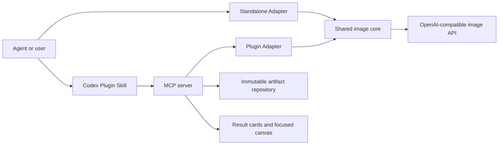

# Architecture

This document describes the stable boundaries that let one image core support a portable Standalone Skill and a Codex App Plugin. Use the [user guides](./guides/README.md) for installation and configuration.

## Sources of truth

| Source | Responsibility |
| --- | --- |
| `scripts/` | Shared image protocol, validation, transforms, delivery, and QA |
| `mcp/` | Plugin tools, project binding, artifacts, editor state, and runtime calls |
| `web/` | Codex result cards and focused image canvas |
| `scripts/plugin-file-set.mjs` | Distribution file ownership and shared-core evidence |
| `.codex-plugin/plugin.json`, `.mcp.json` | Plugin identity and launch contract |
| `tests/` | Executable public behavior and release boundaries |

## Core flow



## Distribution ownership

| Area | Shared | Standalone only | Plugin only |
| --- | --- | --- | --- |
| Image transport and response validation | Yes |  |  |
| PNG transforms, transparency, delivery, QA | Yes |  |  |
| `auth.json`, CLI, JSONL entry point |  | Yes |  |
| Project binding and config allowlist |  |  | Yes |
| Stable artifact IDs and edit versions |  |  | Yes |
| MCP tools, result cards, canvas |  |  | Yes |

Shared code moves from `scripts/` into both versioned packages. Distribution adapters remain separate so Codex-specific behavior never enters the portable runtime.

## Dependency direction

```text
Codex widget -> MCP server -> Plugin adapter -> shared image core -> provider
Standalone Skill -> Standalone adapter -> shared image core -> provider
```

- The shared image core does not depend on Codex, MCP, or widget code.
- The widget does not read credentials or call the provider.
- MCP tools do not assemble provider requests.
- Configuration and provider failures stop at their owning layer without automatic route changes.

## Artifact and state model

- API originals are published before optional delivery transforms.
- Generated, edited, and delivered images are immutable artifacts with stable IDs.
- Edit annotations are normalized to source-image coordinates and stored as editing intent.
- A `projectBindingId` binds model and widget calls to one project across MCP processes.
- Cross-process registries use atomic file replacement and owned locks; stale writers cannot publish over a replacement owner.

## Release model

- One version and tag produce a Standalone Skill archive and a Codex Plugin archive.
- `dist/` is tracked so the Git-backed Plugin installs without a source build or local web server.
- The release builder verifies that shared Python files are byte-identical across packages.
- One `SHA256SUMS` file covers both archives and the shared-core evidence file.
- Marketplace, plugin manifest, package metadata, tag, and release assets must report one version.

## Change matrix

| Change | Required implementation review | Required validation |
| --- | --- | --- |
| Shared image behavior | Shared core and both adapters | Python tests, Plugin bridge tests, dual release evidence |
| Standalone CLI or config | Standalone adapter and guide | Python tests and Standalone archive |
| MCP or artifact behavior | MCP and Plugin guide | Node tests, build, plugin check |
| Result cards or canvas | `web/`, MCP Apps bridge | Widget tests and Codex App acceptance |
| Distribution metadata | Both manifests and release builder | Version, file-set, archive, and marketplace checks |
