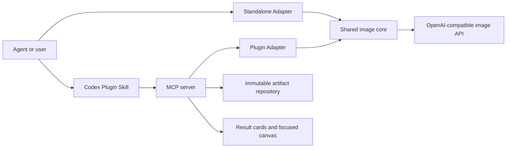

# Architecture

> Parent: [Documentation](./README.md)

Language: [简体中文](./arch.zh-CN.md)

This document is for contributors and maintainers. It defines the stable module, dependency, configuration, state, and release boundaries that let one image core support a portable Standalone Skill and a Codex App Plugin. It does not provide installation or configuration steps; use the [user guides](./guides/README.md) for those tasks.

## Sources of truth

| Source | Responsibility |
| --- | --- |
| `scripts/` | Shared image protocol, validation, transforms, delivery, and QA |
| `mcp/` | Plugin tools, project binding, artifacts, editor state, and runtime calls |
| `web/` | Codex result cards and focused image canvas |
| `web/widget-i18n.mjs` | English and Chinese Widget message catalog and locale resolution |
| `scripts/plugin-file-set.mjs` | Distribution file ownership and shared-core evidence |
| `.codex-plugin/plugin.json`, `.mcp.json` | Plugin identity and launch contract |
| `tests/` | Executable public behavior and release boundaries |

## Core flow



## Distribution ownership

| Area | Shared | Standalone only | Plugin only |
| --- | --- | --- | --- |
| Image transport and response validation | Yes |  |  |
| PNG transforms, transparency, delivery, QA | Yes |  |  |
| `auth.json`, CLI, JSONL entry point |  | Yes |  |
| Project binding and config allowlist |  |  | Yes |
| Stable artifact IDs and edit versions |  |  | Yes |
| MCP tools, result cards, canvas |  |  | Yes |

Shared code moves from `scripts/` into both versioned packages. Distribution adapters remain separate so Codex-specific behavior never enters the portable runtime.

## Dependency direction

```text
Codex widget -> MCP server -> Plugin adapter -> shared image core -> provider
Standalone Skill -> Standalone adapter -> shared image core -> provider
```

- The shared image core does not depend on Codex, MCP, or Widget code.
- The Widget does not read credentials or call the provider.
- MCP tools do not assemble provider requests.
- Failures stop at their owning layer without changing providers, models, endpoints, authentication sources, protocols, or routes.

## Configuration boundaries

- The Standalone Skill reads only `auth.json` beside the installed Skill.
- The Codex Plugin reads its fixed user configuration and an optional project configuration.
- The two packages never scan, merge, or fall back to each other's configuration.
- Project configuration may override only allowlisted defaults. It cannot replace the provider, model, endpoint, authentication source, credential, or route permissions.

## Artifact and state model

- API originals are published before optional delivery transforms.
- Generated, edited, and delivered images are immutable artifacts with stable IDs.
- Edit annotations are normalized to source-image coordinates and stored as editing intent.
- Meaningful focused-canvas drafts are saved per stable image ID before session finalization and restored for the same image.
- Widget locale comes from the host context. Every Chinese locale variant uses one Chinese catalog; missing and non-Chinese locales use English. Plugin and MCP metadata use English defaults.
- A `projectBindingId` binds model and Widget calls to one project across MCP processes.
- Configuration writes and project binding protect their target directories with a local `.gitignore` containing only `*`; incompatible existing rules stop the operation without being overwritten.
- Cross-process registries use atomic file replacement and owned locks so stale writers cannot publish over a replacement owner.

## Release model

- One version and tag produce a Standalone Skill archive and a Codex Plugin archive.
- `dist/` is tracked so the Git-backed Plugin installs without a source build or local web server.
- The release builder verifies that shared Python files are byte-identical across the two packages.
- One `SHA256SUMS` file covers both archives and the shared-core evidence file.
- Versioned release notes and the matching `CHANGELOG.md` section are part of the tagged release source.
- Marketplace metadata, Plugin manifests, package metadata, tag, and release assets report one version.

## Change matrix

| Change | Required implementation review | Required validation |
| --- | --- | --- |
| Shared image behavior | Shared core and both adapters | Python tests, Plugin bridge tests, dual release evidence |
| Standalone CLI or config | Standalone adapter and guide | Python tests and Standalone archive |
| MCP or artifact behavior | MCP and Plugin guide | Node tests, build, Plugin check |
| Result cards or canvas | `web/`, MCP Apps bridge | Widget tests and Codex App acceptance |
| Widget-visible text | English/Chinese message catalog, public metadata, affected README pair | Locale tests, English no-Han gate, metadata gate, Codex App acceptance |
| Distribution metadata | Both manifests and release builder | Version, file-set, archive, and marketplace checks |
