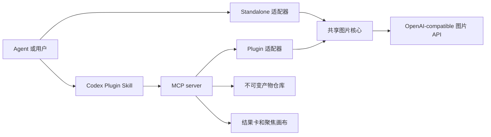

# 架构

> 上级：[文档](./README.zh-CN.md)

[English](./arch.md) | 简体中文

本文面向贡献者和维护者，定义同一图片核心支持便携式 Standalone Skill 和 Codex App Plugin 时的稳定模块、依赖、配置、状态与发行边界。本文不提供安装或配置步骤；需要完成这些任务时，请使用[用户指南](./guides/README.zh-CN.md)。

## 真相源

| 来源 | 职责 |
| --- | --- |
| `scripts/` | 共享图片协议、验证、转换、交付和 QA |
| `mcp/` | Plugin 工具、项目绑定、产物、编辑器状态和运行时调用 |
| `web/` | Codex 结果卡和聚焦图片画布 |
| `web/widget-i18n.mjs` | Widget 英文和中文消息目录及 locale 解析 |
| `scripts/plugin-file-set.mjs` | 发行文件归属和共享核心证据 |
| `.codex-plugin/plugin.json`、`.mcp.json` | Plugin 身份和启动契约 |
| `tests/` | 可执行的公开行为和发行边界 |

Plugin 在包级别保持平台无关。`scripts/repository_fs.py` 是唯一的文件系统入口：Windows 选择 `windows_repository_fs.py`，macOS/Linux 选择 `posix_repository_fs.py`。两个适配器提供相同的仓库、提交锁、原子发布和安全路径契约；适配器只属于 Plugin，不进入 Standalone 压缩包。

## 核心流程



## 发行职责

| 范围 | 共享 | 仅 Standalone | 仅 Plugin |
| --- | --- | --- | --- |
| 图片传输和响应验证 | 是 |  |  |
| PNG 转换、透明处理、交付和 QA | 是 |  |  |
| `auth.json`、CLI、JSONL 入口 |  | 是 |  |
| 项目绑定和配置白名单 |  |  | 是 |
| 稳定产物 ID 和编辑版本 |  |  | 是 |
| MCP 工具、结果卡和画布 |  |  | 是 |

共享代码从 `scripts/` 进入两个版本化发行包。两种发行适配器保持分离，Codex 专属行为不会进入便携式运行时。

| 平台 | Python 命令 | 文件系统适配器 | UI 限制 |
| --- | --- | --- | --- |
| Windows | `python` | `windows_repository_fs.py` | 支持在资源管理器中显示 |
| macOS/Linux | `python3` | `posix_repository_fs.py` | 不提供“在文件夹中显示” |

可使用 `OPENAI_COMPATIBLE_IMAGEGEN_PYTHON` 显式覆盖命令。运行时首次使用前会验证 Python 3.12 或更高版本；覆盖值无效或预检失败时停止，不会轮询多个命令。

## 依赖方向

```text
Codex widget -> MCP server -> Plugin adapter -> shared image core -> provider
Standalone Skill -> Standalone adapter -> shared image core -> provider
```

- 共享图片核心不依赖 Codex、MCP 或 Widget 代码。
- Widget 不读取凭据，也不调用 provider。
- MCP 工具不组装 provider 请求。
- 故障停在所属层，不会改变 provider、model、endpoint、认证来源、协议或路线。

## 配置边界

- Standalone Skill 只读取已安装 Skill 同目录的 `auth.json`。
- Codex Plugin 读取固定的用户配置和可选项目配置。
- 两种发行包不会扫描、合并或回退到对方的配置。
- 项目配置只能覆盖白名单内的默认值，不能替换 provider、model、endpoint、认证来源、凭据或路线权限。

## 产物与状态模型

- API 原图先发布，再执行可选的本地交付转换。
- 已生成、编辑和交付的图片都是带稳定 ID 的不可变产物。
- 编辑标注会归一化到源图片坐标并保存为编辑意图。
- 有意义的聚焦画布草稿按稳定图片 ID 保存，并在会话结束前写入；再次打开同一图片时恢复。
- Widget locale 来自宿主上下文。所有中文 locale 变体使用同一中文目录；缺失或非中文 locale 使用英文。Plugin 和 MCP metadata 默认使用英文。
- `projectBindingId` 跨 MCP 进程把模型和 Widget 调用绑定到同一项目。
- 配置写入和项目绑定使用内容仅为 `*` 的本地 `.gitignore` 保护目标目录；现有规则不兼容时停止操作，不覆盖原规则。
- 跨进程注册表使用原子文件替换和归属锁，旧写入者不能覆盖新的归属者。

## 发布模型

- 一个版本和标签同时生成 Standalone Skill 压缩包与一个平台无关的 Codex Plugin 压缩包。Windows、Linux 和 macOS 分别构建候选；只有文件集和 SHA-256 字节完全一致时才能进入发布环境。
- `dist/` 纳入 Git，使 Git-backed Plugin 安装不需要源码构建或本地 Web server。
- 发布构建器验证两个发行包中的共享 Python 文件逐字节一致。
- 一个 `SHA256SUMS` 文件覆盖两个压缩包和共享核心证据文件。
- 版本化 release notes 和对应的 `CHANGELOG.md` 章节属于标签源码。
- Marketplace metadata、Plugin manifest、package metadata、标签和发布资产使用同一版本。

## 变更矩阵

Codex App 验收按实际变化的边界判断，不只看文件路径。Plugin manifest、marketplace、宿主加载、安装或缓存身份、工具注入、MCP Apps bridge，或确定性自动化无法观察的行为发生变化时，在开发阶段执行验收。其他 Plugin 改动可以推迟到最终发布候选。每个最终发布候选都在可用目标平台执行验收；没有真实设备的平台明确标记为未验证，并按当前发布计划的平台矩阵处理。

| 变更 | 必须检查的实现 | 必须执行的验证 |
| --- | --- | --- |
| 共享图片行为 | 共享核心和两个适配器 | Python 测试、Plugin bridge 测试、双发行证据 |
| Standalone CLI 或配置 | Standalone 适配器和指南 | Python 测试和 Standalone 压缩包 |
| MCP 或产物行为 | MCP 和 Plugin 指南 | Node 测试、构建、Plugin 检查、按风险执行 Codex App 验收 |
| 结果卡或画布 | `web/`、MCP Apps bridge | Widget 测试、按风险执行 Codex App 验收 |
| Widget 可见文本 | 英文/中文消息目录、公开 metadata、受影响的 README 对 | locale 测试、英文无汉字检查、metadata 检查、按风险执行 Codex App 验收 |
| 发行 metadata | 两个 manifest 和发布构建器 | 版本、文件集、压缩包、marketplace 检查、按风险执行 Codex App 验收 |
