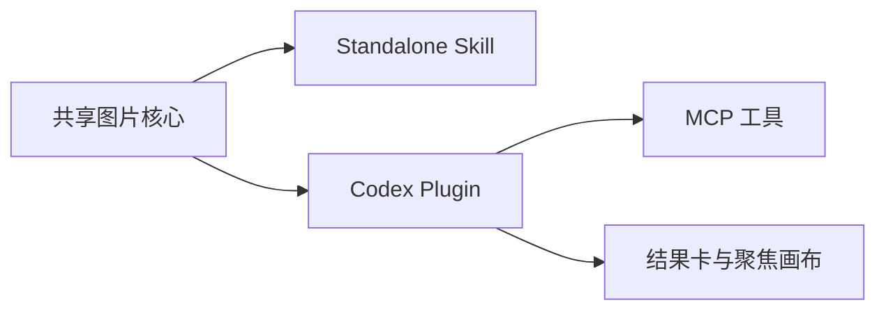

# 项目总览

## 元信息

| 项目 | 值 |
| --- | --- |
| 作者 | 小为 |
| 维护人 | Syh1906 |
| 状态 | 已完成 |
| 创建日期 | 2026-08-16 |
| 最后更新 | 2026-08-16 |

## 概述

OpenAI-Compatible Images 面向需要使用 OpenAI-compatible 图片服务的用户，以同一图片核心提供可移植的 Standalone Skill 和 Codex App Plugin。

## 文档定位

- 本文负责建立产品形态、系统边界和阅读顺序。
- 本文不替代安装指南、配置指南、架构说明和运行时 Skill。
- 具体行为冲突时，先信插件清单、代码、测试和发行制品。

## 真相源

| 来源 | 负责内容 |
| --- | --- |
| `.codex-plugin/plugin.json`、`.mcp.json` | Plugin 身份与启动入口 |
| `scripts/`、`mcp/`、`web/` | 图片核心、MCP 工具和工作台实现 |
| `tests/`、`dist/` | 行为验证与预构建 Plugin 内容 |
| `docs/README.md` | 公开文档导航 |

## 文档边界

- 本文解释产品定位、两种发行形态、关键目录和阅读顺序。
- 本文不展开配置字段、安装步骤或发布阶段。

## 关键图示

## 项目定位

Standalone Skill 服务通用 Agent 和命令行工作流；Codex Plugin 服务 Codex App 的完整图片生成、结果展示、标注和版本管理流程。

## 系统边界

- 项目负责 OpenAI-compatible 图片请求、本地交付、Plugin MCP 工具、结果卡和聚焦画布。
- 项目不提供图片模型服务、不托管用户密钥，也不把公共远程 MCP 作为当前发行前提。

## 关键目录

| 目录 | 作用 |
| --- | --- |
| `scripts/` | 共享图片核心与发行 Adapter |
| `mcp/` | Codex Plugin MCP server |
| `web/` | 结果卡和聚焦画布源代码 |
| `dist/` | Git-backed 安装直接使用的预构建 Plugin |
| `skills/` | Plugin 内置运行时 Skill |
| `references/` | Standalone 能力参考 |
| `docs/` | 公开用户和维护文档 |

## 阅读顺序

1. 从 [docs 导航](./README.md) 选择读者任务。
2. 首次安装读 [安装指南](./guides/installation.md)。
3. 参与维护读 [架构说明](./arch.md) 和根 `AGENTS.md`。

## 变更记录

| 日期 | 变更 | 说明 |
| --- | --- | --- |
| 2026-08-16 | 初始版本 | 建立双发行产品总览和公开文档入口。 |
